# Generative Modelling: Comparative Study of Diffusion, Energy-Based, and Flow-Based Models

This repository contains implementations of contemporary generative modeling approaches: Energy-Based Models (EBM), Diffusion Probabilistic Models, Classifier-Free Guidance, Flow Matching, and Score-Based Models. All models are trained and evaluated on 2D synthetic datasets to facilitate theoretical understanding and visual interpretation.

## Models Implemented

### 1. Energy-Based Models (EBM) with Contrastive Divergence
**File:** `ebm_cd_mcmc.py`

Trains an energy network using Contrastive Divergence (CD) with Langevin MCMC sampling.

- **Training objective:** Minimize energy of real data, maximize energy of model samples
- **Sampling:** Langevin dynamics for both training and inference
- **Architecture:** Multi-layer perceptron with SiLU activations
- **Data:** 2D mixture of 8 Gaussians

**Run training:**
```bash
python ebm_cd_mcmc.py
```

**Key outputs:**
- `outputs/ebm/trained/energy_net.pt` - Trained energy network
- `outputs/ebm/trained/ebm_grid_trained.png` - Sampling progression grid
- `outputs/ebm/untrained/` - Untrained model samples for comparison

**Sampling progression (trained):**

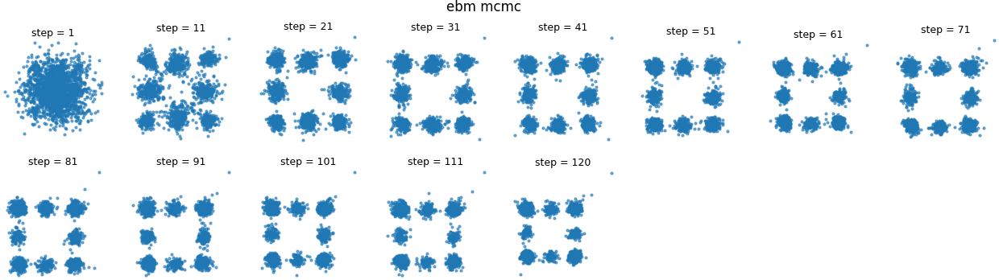

### 2. EBM Energy Landscape Visualization
**File:** `ebm_energy_visualization.py`

Visualizes the learned energy landscape of trained and untrained EBM models.

**Key observations:**
- Trained models exhibit sharp energy minima at learned data modes
- Untrained models display flat, uniform energy landscapes
- Empirical validation of the theoretical relationship: $p(x) \propto \exp(-E(x))$

**Generate visualizations:**
```bash
python ebm_energy_visualization.py
```

**Outputs:**
- `outputs/ebm/trained/ebm_energy_grid_trained.png` - Trained energy landscape
- `outputs/ebm/untrained/ebm_energy_grid_untrained.png` - Untrained energy landscape

| Trained energy landscape | Untrained energy landscape |
| :---: | :---: |
| 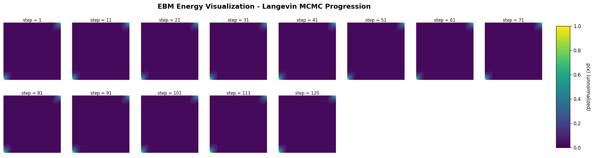 | 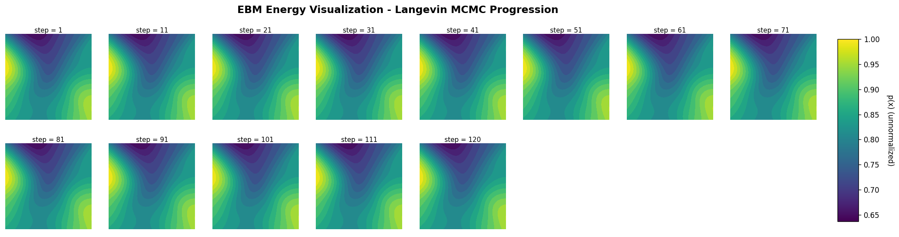 |

### 3. EBM 3D Energy Landscape Visualization
**File:** `ebm_energy_3d_visualization.py`

Renders the EBM energy function as a 3D surface, overlaying real data points and annotating critical points (energy minima and maxima) with directional arrows.

**Methodology:**
- Evaluates the trained energy network over a dense 2D grid and lifts it into a 3D surface
- Real data points are projected onto the surface to show that they fall into the learned energy valleys
- Local minima (valleys) and maxima (peaks) are detected with `scipy.signal.argrelextrema` and annotated
- Produces individual surfaces plus a side-by-side trained vs. untrained comparison

**Generate visualizations:**
```bash
python ebm_energy_3d_visualization.py
```

**Outputs:**
- `outputs/ebm/trained/energy_landscape_3d_trained.png` - Trained 3D surface
- `outputs/ebm/untrained/energy_landscape_3d_untrained.png` - Untrained 3D surface
- `outputs/ebm/trained/energy_landscape_3d_comparison.png` - Side-by-side comparison

**Trained vs. untrained energy surfaces:**

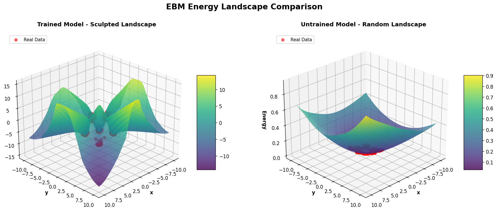

### 4. Diffusion Models (DDPM)
**File:** `diffusion_train.py`

Denoising diffusion probabilistic model (DDPM) implementation following Ho et al. (2020).

**Methodology:**
- Forward process: Progressive Gaussian noise addition to data
- Reverse process: Learned denoising through noise prediction network
- Training objective: Mean squared error on predicted noise
- Sampling: Stochastic reverse process with explicit noise injection

**Run training:**
```bash
python diffusion_train.py
```

**Key outputs:**
- `outputs/diffusion/trained/noise_net.pt` - Trained noise prediction network
- `outputs/diffusion/trained/diffusion_grid_trained.png` - Sampling progression visualization
- `outputs/diffusion/untrained/diffusion_grid_untrained.png` - Untrained baseline

**Sampling progression (trained):**

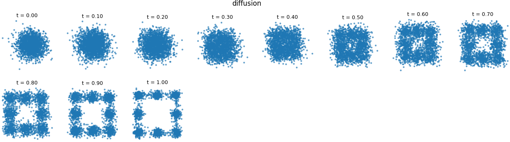

### 5. Classifier-Free Guidance Diffusion (DDPM-CFG)
**File:** `diffusion_train_cfg.py`

Conditional DDPM trained with classifier-free guidance (Ho & Salimans, 2022), enabling class-controllable generation over the 8 Gaussian modes.

**Methodology:**
- **Conditioning:** Each mode is treated as a class label, embedded and added to the time embedding
- **Condition dropout:** During training, labels are randomly replaced with a null token (`cond_drop_prob = 0.1`) so the network learns both conditional and unconditional scores
- **Guidance:** At sampling time, the noise prediction is extrapolated as
  $\hat\epsilon = \epsilon_\text{uncond} + w\,(\epsilon_\text{cond} - \epsilon_\text{uncond})$ with guidance scale $w = 3.0$
- **Outputs:** A mixed (random-label) grid plus one grid per class

**Run training:**
```bash
python diffusion_train_cfg.py
```

**Key outputs:**
- `outputs/diffusion_cfg/trained/noise_net_cfg.pt` - Trained conditional noise network
- `outputs/diffusion_cfg/trained/diffusion_cfg_grid_trained_all.png` - Mixed-class sampling grid
- `outputs/diffusion_cfg/trained/diffusion_cfg_grid_trained_c{0..7}.png` - Per-class sampling grids
- `outputs/diffusion_cfg/untrained/diffusion_cfg_grid_untrained.png` - Untrained baseline

**Mixed-class sampling progression (trained):**

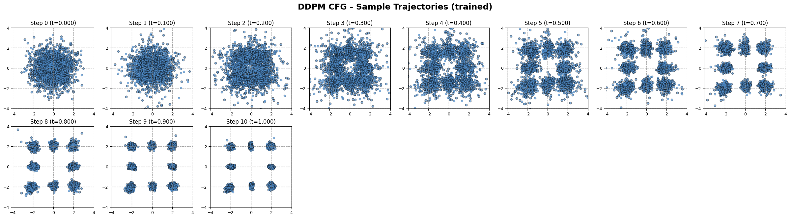

#### Combined CFG Grid
**File:** `combine_cfg_grids.py`

Utility that composes the untrained baseline, seven per-class grids (classes 0–6), and the mixed-class grid into a single annotated poster using Pillow. The nine panels are arranged as a 3×3 grid in row-major order (untrained first, then each class, then all classes).

**Run:**
```bash
python combine_cfg_grids.py
```

**Output:**
- `outputs/diffusion_cfg/diffusion_cfg_grid_combined.png` - Combined poster of all CFG grids

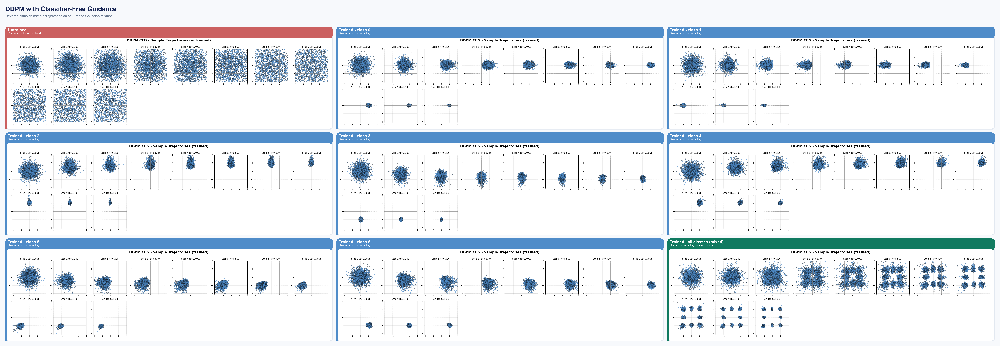

#### Animated Reverse Diffusion
**File:** `animate_cfg_grid.py`

Replays the trained model's reverse-diffusion process as an animated GIF, laid out in the same 3×3 panel arrangement as the combined grid (untrained, classes 0–6, all classes). Each panel animates the sample cloud collapsing from Gaussian noise ($t = 1.0$) into its target distribution ($t = 0.0$): the untrained panel stays as noise, each conditional panel converges to a single mode, and the mixed panel forms the full 8-mode mixture.

**Run:**
```bash
python animate_cfg_grid.py
```

**Output:**
- `outputs/diffusion_cfg/diffusion_cfg_reverse.gif` - Animated reverse-diffusion trajectories

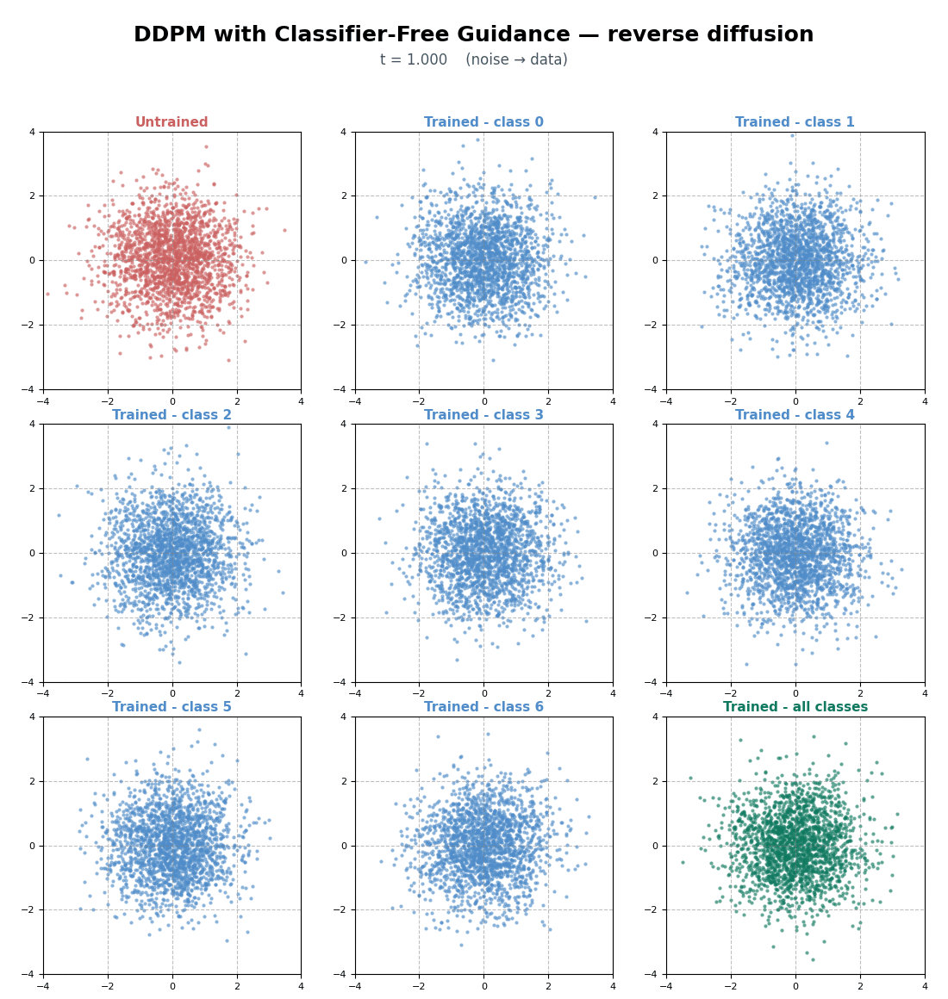

### 6. Score-Based Generative Models
**File:** `diffusion_score_matching.py`

Score-based approach using score matching objective as an alternative to noise prediction.

**Methodology:**
- **Score function:** $\nabla_x \log p(x|t)$ representing log-probability gradients at different noise levels
- **Training objective:** Score matching loss
- **Sampling:** Reverse-time stochastic differential equation with learned scores
- **Theoretical advantage:** Direct gradient estimation versus indirect noise prediction

**Run training:**
```bash
python diffusion_score_matching.py
```

**Key outputs:**
- `outputs/diffusion_score/trained/score_net.pt` - Trained score network
- `outputs/diffusion_score/trained/diffusion_score_grid_trained.png` - Sampling progression
- `outputs/diffusion_score/untrained/diffusion_score_grid_untrained.png` - Untrained baseline

**Sampling progression (trained):**

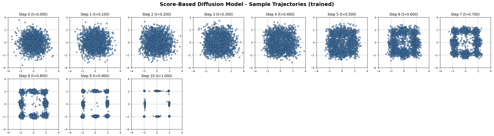

### 7. Flow Matching
**File:** `flow_matching_train.py`

Flow-based generative model using continuous-time matching between distributions.

**Methodology:**
- **Velocity network:** Learns the flow field from noise to data distribution
- **Training objective:** Conditional flow matching loss
- **Sampling:** Deterministic ODE integration from prior to data distribution
- **Advantage over diffusion:** Simplified training and deterministic generation process

**Run training:**
```bash
python flow_matching_train.py
```

**Key outputs:**
- `outputs/flow_matching/trained/velocity_net.pt` - Trained velocity network
- `outputs/flow_matching/trained/flow_matching_grid_trained.png` - Sampling progression
- `outputs/flow_matching/untrained/flow_matching_grid_untrained.png` - Untrained baseline

**Sampling progression (trained):**

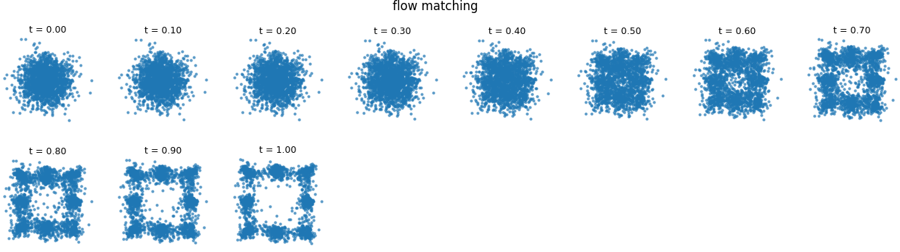

### 8. Unified Trajectory & Vector-Field Visualization
**File:** `generate_trajectories.py`

Loads the trained DDPM, Flow Matching, and Score-Based models and produces side-by-side comparisons of how particles travel from the prior to the data distribution, plus the learned vector fields driving them.

**Methodology:**
- **Particle trajectories:** Tracks individual particles step-by-step from initial noise to the final samples, marking start (circle) and end (star) positions against the target modes
- **Vector fields:** Visualizes the learned field at multiple time steps — noise field (DDPM), velocity field (Flow Matching), and score field (Score-Based) — with arrows colored by magnitude

**Generate visualizations:**
```bash
python generate_trajectories.py
```

**Outputs (per model):**
- `outputs/trajectories/{model}_particle_trajectories.png`
- `outputs/trajectories/{model}_field.png`

**Particle trajectories:**

| Diffusion (DDPM) | Flow Matching | Score-Based |
| :---: | :---: | :---: |
| 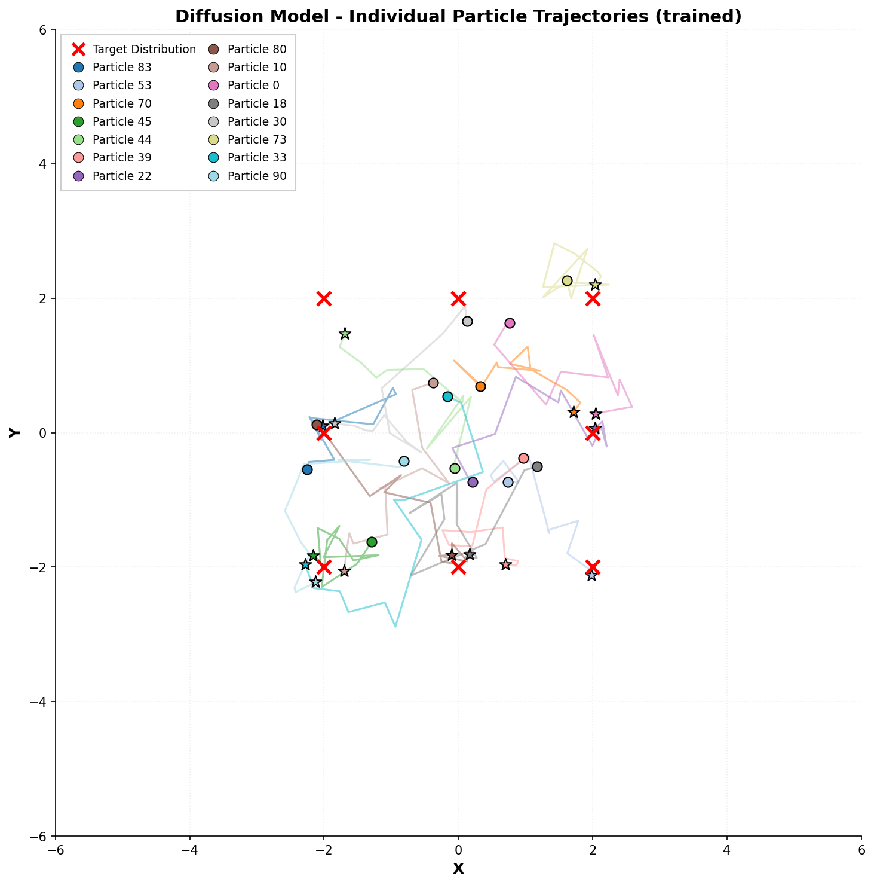 | 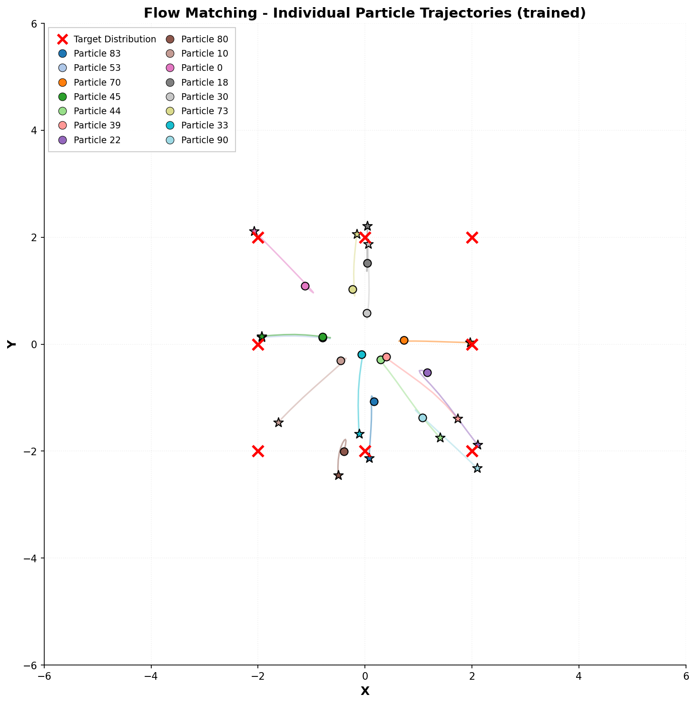 | 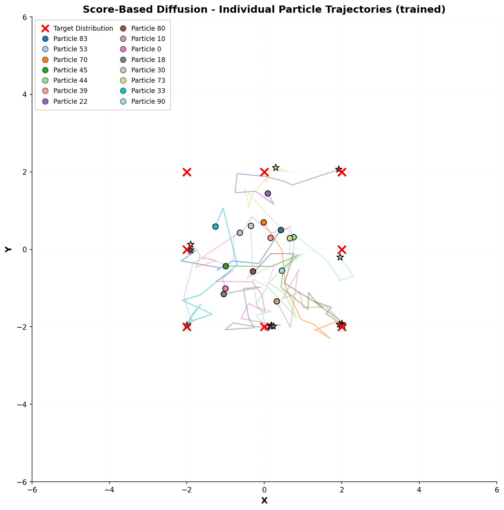 |

**Learned vector fields:**

| Diffusion noise field | Flow velocity field | Score field |
| :---: | :---: | :---: |
|  | 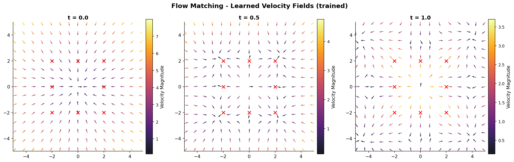 | 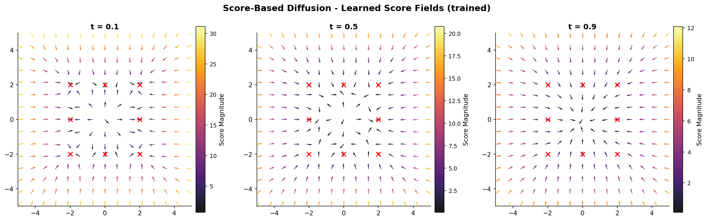 |

## Directory Structure

```
outputs/
├── ebm/
│   ├── trained/
│   │   ├── energy_net.pt
│   │   ├── ebm_grid_trained.png
│   │   ├── ebm_energy_grid_trained.png
│   │   ├── energy_landscape_3d_trained.png
│   │   └── energy_landscape_3d_comparison.png
│   └── untrained/
│       ├── ebm_samples_untrained.npy
│       ├── ebm_energy_grid_untrained.png
│       └── energy_landscape_3d_untrained.png
├── diffusion/
│   ├── trained/
│   │   ├── noise_net.pt
│   │   └── diffusion_grid_trained.png
│   └── untrained/
│       └── diffusion_grid_untrained.png
├── diffusion_cfg/
│   ├── trained/
│   │   ├── noise_net_cfg.pt
│   │   ├── diffusion_cfg_grid_trained_all.png
│   │   └── diffusion_cfg_grid_trained_c0..c7.png
│   ├── untrained/
│   │   └── diffusion_cfg_grid_untrained.png
│   ├── diffusion_cfg_grid_combined.png
│   └── diffusion_cfg_reverse.gif
├── diffusion_score/
│   ├── trained/
│   │   ├── score_net.pt
│   │   └── diffusion_score_grid_trained.png
│   └── untrained/
│       └── diffusion_score_grid_untrained.png
├── flow_matching/
│   ├── trained/
│   │   ├── velocity_net.pt
│   │   └── flow_matching_grid_trained.png
│   └── untrained/
│       └── flow_matching_grid_untrained.png
└── trajectories/
    ├── diffusion_model_particle_trajectories.png
    ├── diffusion_model_field.png
    ├── flow_matching_particle_trajectories.png
    ├── flow_matching_field.png
    ├── score-based_diffusion_particle_trajectories.png
    └── score-based_diffusion_field.png
```

## Requirements

- PyTorch
- NumPy
- Matplotlib
- Pillow (for `combine_cfg_grids.py`)
- SciPy (for critical-point detection in 3D energy visualization)
- scikit-learn (optional, for k-means in EBM visualization)

## Key Concepts

### Energy-Based Models
- **Energy function:** Maps data points to scalar energy values
- **Training:** Contrastive divergence - push down energy of real data, push up energy of generated samples
- **Sampling:** Langevin dynamics (gradient descent with noise)
- **Mathematical:** $p(x) = \frac{1}{Z} \exp(-E(x))$

### Diffusion Models
- **Noise scheduling:** Progressive noise addition over time steps
- **Reverse process:** Learn to denoise gradually
- **Score matching:** Directly learn gradients of log-probability

### Classifier-Free Guidance
- **Joint training:** A single network learns both conditional and unconditional noise prediction via condition dropout
- **Guided sampling:** Interpolate/extrapolate between the two predictions to trade diversity for class fidelity
- **Controllable generation:** Sample from a chosen mode without a separate classifier

### Flow Matching
- **Continuous dynamics:** ODE-based generation
- **Velocity network:** Direct learning of sample paths
- **Advantage:** Simpler training than diffusion, single ODE solver

## Visualization and Interpretation

### Sampling Progression Analysis

All models produce visualizations documenting the sampling trajectory across multiple time steps:

**Trained Models:**
- Progressive convergence toward the target data distribution (8-mode Gaussian mixture)
- Discernible structure in sample concentration patterns
- Final empirical distribution approaches training data distribution

**Untrained Models:**
- Baseline behavior without learned generative capacity
- Flow Matching: Deterministic but unstructured trajectories
- Diffusion/Score-Based: Dominated by stochastic noise with no coherent structure

### Behavioral Distinctions

**Deterministic Sampling (Flow Matching):**
- ODE-based generation without stochastic components
- Reproducible trajectories for given initial conditions
- Untrained models exhibit fixed, non-convergent patterns

**Stochastic Sampling (Diffusion and Score-Based):**
- Incorporates explicit Gaussian noise at each generation step
- Probabilistic reverse process following learned dynamics
- Untrained models demonstrate uniform noise dominance

### Trajectory and Vector-Field Analysis

- **Particle trajectories** trace how each model transports a particle from prior noise to a data mode, making the deterministic (Flow Matching) vs. stochastic (DDPM, Score-Based) behavior directly visible.
- **Vector fields** expose what each network actually learns — the noise field (DDPM), velocity field (Flow Matching), and score field (Score-Based) — and how these fields point samples toward the data modes over time.

### Energy-Based Model Characterization

**Trained energy landscape:**
- Sharp, concentrated minima corresponding to data modes
- Strong energy differentiation across sample space
- Validates relationship $p(x) \propto \exp(-E(x))$

**Untrained energy landscape:**
- Flat, structureless energy surface
- Absence of preferred sampling regions
- Confirms model has not learned data distribution

The 3D energy visualization makes this distinction tangible: the trained surface is sculpted into deep valleys at the data modes (with real points settling into them), while the untrained surface remains a near-flat, random sheet.
